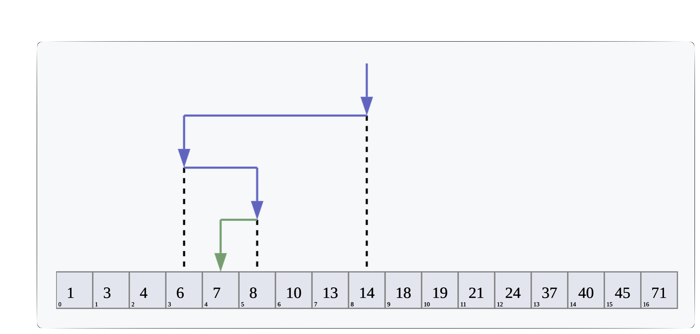

# MIPT Project 1 : Number Guessing & Binary Search

### Contents <a name="contents"></a>
[1. About](.README.md#about)  
[2. Why?](.README.md#Какой-кейс-решаем)  
[4. Process](.README.md#Этапы-работы-над-проектом)  
[5. Results](.README.md#Результат)    
[6. Conclusions](#conclusions) 

### About <a name="about"></a>
> **Note**
> This is a learning expirience.

  
*Угадать загаданное компьютером число за минимальное число попыток.*

### Why?    
Нужно написать программу, которая угадывает число за минимальное число попыток

**Условия соревнования:**  
- Компьютер загадывает целое число от 0 до 100, и нам его нужно угадать. Под «угадать», подразумевается «написать программу, которая угадывает число».
- Алгоритм учитывает информацию о том, больше ли случайное число или меньше нужного нам.

**Метрика качества**     
Результаты оцениваются по среднему количеству попыток при 1000 повторений

**Что практикуем**     

+ `Учимся писать хороший код на python`


### Process

<mark>Двоичный (бинарный)</mark> поиск (также известен как метод деления пополам или дихотомия) — классический алгоритм поиска элемента в отсортированном массиве (векторе), использующий дробление массива на половины. 



<p align="center">Визуализация бинарного поиска по массиву.</p>

<details><summary><b>Пример реализации:</b></summary>

```py
def binary_search(list, key):
    low = 0
    high = len(list) - 1

    while low <= high:
        mid = (low + high) // 2
        midVal = list[mid]
        if midVal == key:
            return mid
        if midVal > key:
            high = mid - 1
        else:
            low = mid + 1

    return 'not found'
```
</details>


### Results:  
....


### Conclusions: <a name="conclusions"></a>
....


[To begining](#contents)